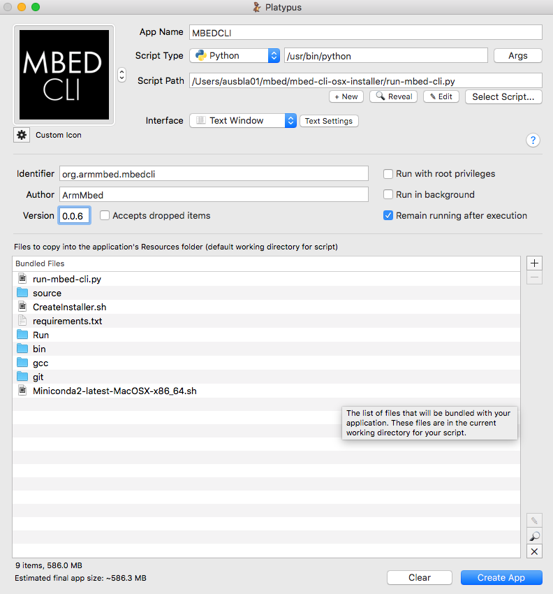

# What is this
This is a single click installer for mbed CLI on OSX. If you want the installer please see the Releases page for the latest download link. 
Included in the installer is the latest stable version of all tools required to develop in the mbed Ecosystem with mbed CLI. 
- Python 2.7.x
- GCC ARM compiler 
- mbed CLI
- mbedls
- mbed-greentea
- mbed-host-tests
- any other relevant mbed python utilities

## How to use
Download the .dmg file, open it. Copy the app to your applications folder. Run application from your applications folder. 

## How does it work
When you run the app a Terminal is opened with modified local session variables that link to the versions of python, gcc compiler and mbed tools included in the installer.

## Why?
Because we want something that 'just works' for users in a consistent, reproducable way.

## But I like installing my tools myself
Cool, you can do that too. See the instructions [here](TODO) for how to install all the tools individually on your system.

## Whats next? 
Go build awesome.  

--------

# How to Build
1) Update all dependencies in repo (GCC, Python Eggs, ...etc)
	- For compiler updates, unzip the folder into the gcc folder, then modify the  `source/run-mbed-cli.sh` files config section to match the new path
	- for adding new tools like mbedls and mbed-cli that should have user available calls from the commandline like `$mbed` you should add them to the `requirements.txt` file.
		- I suggest updating the requirements.txt file each release by running 'curl -O https://raw.githubusercontent.com/ARMmbed/mbed-os/master/requirements.txt'
3) Use Platypus to create .app
	- bundle the gcc, git, source folders, and the requirements.txt and miniconda___.sh files. 
	- Should look like this : 

--------
# Help, things have gone quite wrong
Right, here are some suggestions
1) `chmod 777 run-mbed-cli.sh` - do this because Terminal.app is finicky and this helps sometimes
2) Make sure you are building the app with non-system python. Install Python from brew or something. The following command should return false `python -c "import py2app.build_app; print py2app.build_app.is_system()"`
3) Cannot find packages, getting an error like 'UserWarning: No package named mbed-cli' when trying to build. Solution : the site packages found by Py2app does not contain the modules. Try copying things from the Brew site-packages to your system-python site-packages. 
4) make sure the .app has no spaces in the name, this will cause issues for the underlying scripts. 

--------
# Planned Updates
- update `CreateInstaller.sh` to install python packages from pip directly to install directory instead of installing to the computer

#TODO:
- package up all python packages so it works offline
	* to install we run: ./Miniconda2.sh -b -p /path/to/desired/location
	we use pip2pi (not py2pi, sorry) to create a local-repo.zip
	basically need to run something like `pip2pi local-repo -r /path/to/requirements.txt` to create a directory that looks similar to a pypi repo and zip that up and send it along with miniconda. You only need to do this if you want to install pip requirements offline.
	then, back in the directory where you just installed miniconda, call `./bin/pip install pyocd --no-index --find-links ./local-repo/` to install from a pre-packaged repo, or `./bin/pip install pyocd` to install from online
- Flush out `CreateInstaller.sh` so it can actually create the installer and package it up
- document the hell out of the platypus settings so this whole thins can be redone later. 
- Fix annoying 'doesnt work if folders have spaces in the names' thing. Pretty sure it comes down to use of quotes somewhere
